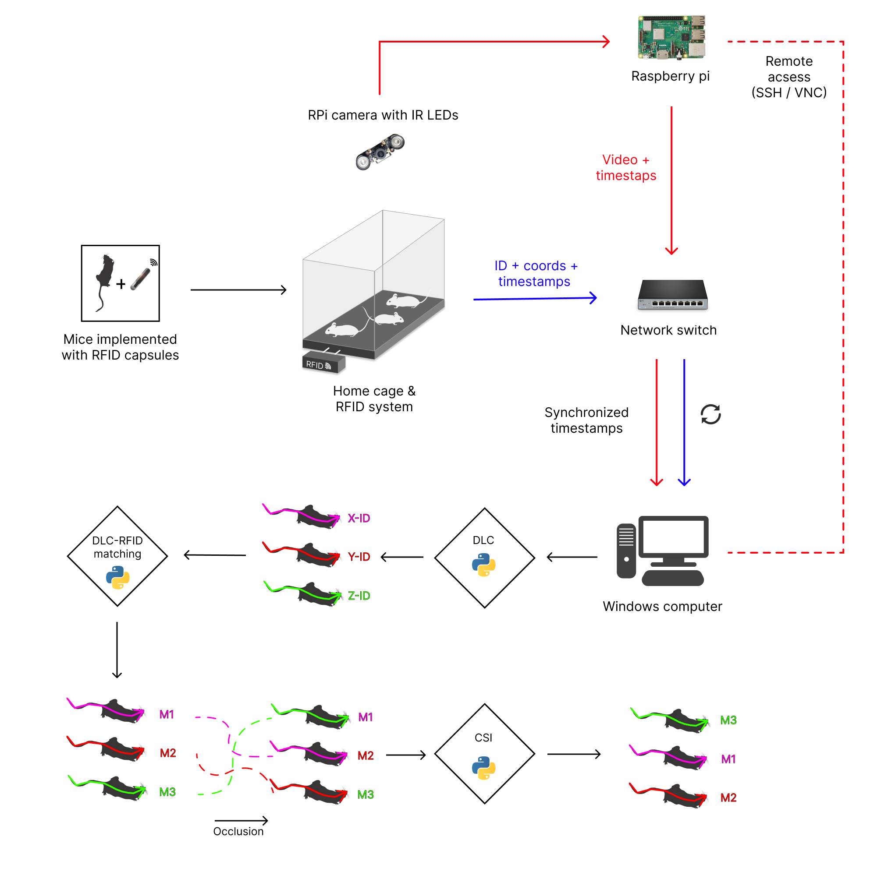
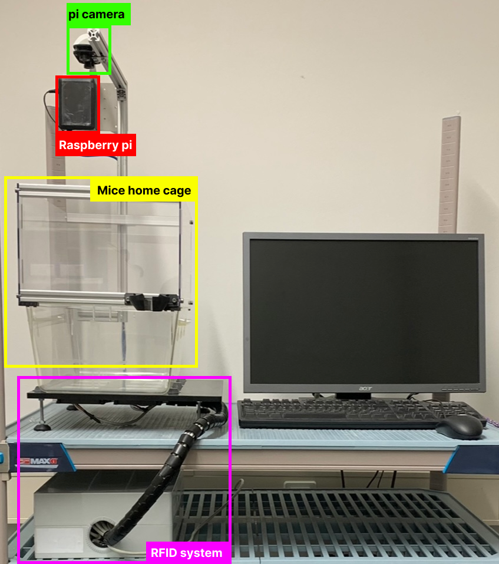
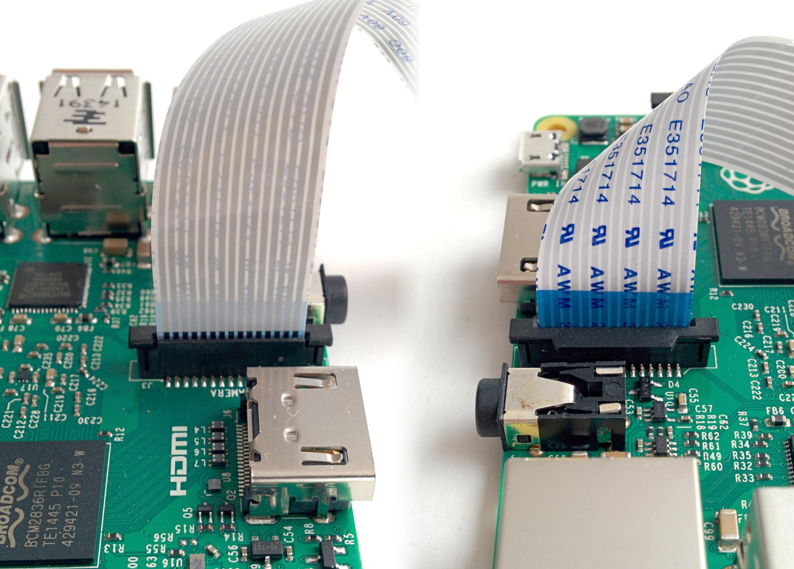
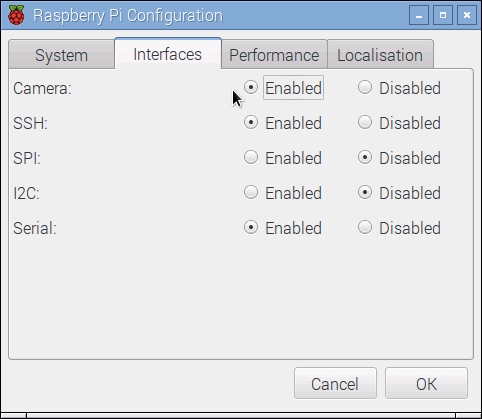
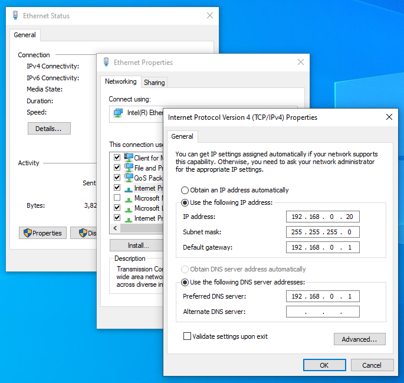

# GroupMouseTrack (GMT)
GMT is aimed at facilitating the study of mouse behavior in social interactions. GMT utilizes state-of-the-art technology to perform pose estimation, tracking, and identification of several interacting identical-looking mice, without the need for physical markers. The project applies an end-to-end solution based on Deep Neural Networks (DNN) with the help of [DeepLabCut (DLC)](https://deeplabcut.github.io/DeepLabCut), a Python framework built on TensorFlow for tracking and localizing several mice bodyparts. Though not required for tracking, GMT provides a set of scripts that seamlessly integrate DLC with an RFID (Radio Frequency Identification) system. This allows for distinguishing between individuals by matching the their RFIDs with their positions in video, and automate periodic correction of potential misidentifications (ID switches) made by the trained Deep Neural Network. This approach eliminates the need for manual inspection. 

todo: add demo gif here.

# Table of Contents
[1. Motivation](#motivation)

[2. Quick start](#quick-start)

[3. What is included](#what-is-included)

[4. Overview](#overview)

  <!-- [4.1. Repository Contents](#repository-contents)  -->

[5. Workflow](#repository-contents) 

[6. Experimental setup](#experimental-setup)

[7. Installation](#installation) 

  <!-- [7.1. Prerequisites](#prerequisites) 

  [7.2. Steps for installation](#steps-for-installation)  -->

[8. (I) Data Acquisition](#(I)-data-acquisition) 
<!-- 
  [8.1. RFID Detection](#rfid-detection) 

  [8.2. Video Recording](#video-recording) -->

[9. (II) Pose estimation and Multi-animal Tracking](#(II)-pose-estimation-and-multi-animal-tracking) 
  
  <!-- [9.1. Jupyter Notebooks templates](#jupyter-notebooks-templates) 
  
  [9.2. Configuration](configuration) 
  
  [9.3. Starting the analysis](#starting-the-analysis) 
  
  [9.4. Troubleshooting](#troubleshooting)  -->

[10. (III) Animal identification and verification](#(III)-Animal-identification-and-verification) 

[11. (IV) Correcting of Switched Identities](#(IV)-Correcting-of-Switched-Identities-(CSI)) 

[12. Getting help](#Getting-help)

# Quick start
todo..

# What is included
todo..

# Overview
The project can be used to record videos of laboratory mice in a homecage suited on an arena of RFID sensors for prolonged periods, and allows for the analysis of new videos from similar experimental setups. The project scripts have been designed to be scalable, customizable, and user-friendly. Additionally, it incorporates an automated method that allows the user to specify the positions of RFID readers dynamically on the video frame without requiring any prior configuration. This feature is particularly useful for maintaining consistency while adjusting the camera position. Although the default number of RFID readers is eight, the scripts can accommodate any number of RFID readers. The trained model has been developed on images containing three mice, but this is not an absolute limit. Users can perform experiments with more or fewer mice of any coat color during inference.

## Repository Contents
```
GroupMouseTrack:
  ├───video_recording
  │   ├───server.py
  │   └───client.py
  ├───DLC
  │   ├───dlc-models
  │   │   └───config.yaml
  │   └───examples
  │       ├───Demo_data
  │       ├───COLAB_template.ipynb
  │       └───JUPYTER_template.ipynb
  ├───RFID
  └───main.py
```
# Workflow
The project consists of four main stages that are independent of each other:

**<u>(I) Data Acquisition:**</u> 
  
  **<u>1.1. Video Recording**</u>  
    In this stage, you will learn how to record video data. If you already have video data and do not need to acquire new data, you can skip this step and move on to the next stage.

  **<u>1.2. RFID Detection</u>**  
    This stage explains how to gather RFID detections, although RFID data is not required for the tracking process (at stage 2). It is only required for the identification process (at stage 3 and 4).

**<u>(II) Pose Estimation and Multi-Animal Tracking</u>**   
In this stage, the recorded videos will be analyzed and evaluated using our trained Deep Neural Network to perform inference. The trained model will be used to estimate the postures and movements of each animal in the video. 

**<u>(III) Animal Identification</u>** 
The DLC generic IDs will be matched and replaced with their associated RFID tags in order to identify the animals.

**<u>(IV) Identity Verification</u>** 
Finally, potential ID-switches between individuals made by DLC will be detected and corrected in order to ensure accurate identification.

<!--  -->
<figure>
  
  <!-- <figcaption>Experimental setup overview.</figcaption> -->
</figure>

# Experimental setup

This documentation provides a comprehensive guide to set up the experiment. You will need the following equipment:

* A PC running Windows OS
* A low-cost Pi-camera [todo: link to be added]
* A Raspberry Pi [todo: link to be added]
* A mouse home-cage
* An RFID system
* RFID microchipped mice
* A router
  
The home-cage is supposed to house the RFID implemented mice. It should be provided with enough food and water. The camera should be placed above the cage to capture the mice's activity. For this project, a small 5-megapixel Raspberry Pi camera (or any compatible camera would work) with two infrared LEDs that automatically switches between day and night mode was used. The Pi-Camera must be connected to a Raspberry Pi (RPi) running on the Raspbian operating system via a flex cable. The RFID reader device should be placed underneath the customized home-cage and connected to a Windows PC via an Ethernet wire, as shown in Figure 2. 
<!-- ## Technical (Hardware) Considerations -->

<figure>
  
  <!-- <figcaption>Experimental setup overview.</figcaption> -->
</figure>

# Installation
## Prerequisites
Before installing the software, make sure you have Python and DLC (DeepLabCut) installed on your PC. Please follow the following instructions

## Steps for Installation
### Step 1: Install Anaconda or Miniconda
Anaconda or Miniconda provides an easy way to install Python and additional packages. You can download and install Anaconda from [here](https://docs.anaconda.com/anaconda/install/windows/) or Miniconda from [here](https://docs.conda.io/en/latest/miniconda.html).

### Step 2: Clone the Repository
Clone the GroupMouseTrack repository from GitHub using the following command in the shell:

```sh
git clone https://github.com/WinterLab-Berlin/GroupMouseTrack.git
```
Alternatively, you can download the package manually from the Git repository. It can be downloaded anywhere on your system, even in the Downloads folder.

### Step 3: Create Conda Environment
Open the Anaconda Prompt app using the search bar (or press Windows key and search for Anaconda Prompt). Navigate to the GroupMouseTrack folder in the Anaconda Command Prompt using the following command:

```sh
cd C:\Users\YourUserName\Desktop\GroupMouseTrack
```
You can also use a trick to get the location right by holding SHIFT and right-clicking and then selecting "Copy as path."

Create a conda Python virtual [environment](https://conda.io/projects/conda/en/latest/user-guide/tasks/manage-environments.html), which includes all the required packages by typing the following command:

```sh
conda env create -f gmt_conda.yaml
```
You can now use this environment from anywhere on your computer without going back into the conda folder. To activate the environment, run the following command:

```sh
conda activate GroupMouseTrack
```
Now, you should see `(GroupMouseTrack)` on the left of your terminal screen. Note that there is no need to run install python or DeeLabCut as it is already installed.

> Note: All instructions in this section need to be done only one time.

# (I) Data Acquisition
## 1. RFID Detection
To collect RFID data, you need to use the X-software (todo: add name of RFID-software) on the Windows PC. The software records events of mouse detection generated by the RFID readers, and saves the data as events in a CSV file. Each event contains information about the mouse's identity, the timestamp of its movement and its position. It is important to note that RFID reads can be imprecise, and a tag can be read from multiple readers in a single time segment i.e. the RFID system can only estimate the position of the RFID tags. This step can be done either before or after the video starting the recording session. However, it is recommended to start gathering the RFID data before the video recording session stars.

todo : add a screenshot here of the RFID application.

## 2. Video Recording
The communication between the Raspberry Pi and Windows PC is enabled by using the SSH protocol (or VNC would also work). The Raspberry Pi camera captures image frames, which are encoded into an H264 video file. Additionally, A CSV file will be automatically created to store the timestamp of the first captured frame, which is important for synchronizing videos with RFID data for the ID matching process. For the video recording, a simple network communication protocol is used to send a continual stream of video frames. Two scripts are provided: a server that runs on the Windows machine and waits for a connection from the Raspberry Pi, and a client that runs on the Raspberry Pi and sends a continual stream of images to the server.

The picamera package is used to interface with the Raspberry Pi camera, providing a pure Python interface. If the Rasbian OS is used, picamera is likely to be already installed. To check, Python can be started and picamera can be imported using the command:

```sh
python -c "import picamera"
```

If picamera is not already installed, it can be easily installed using the apt tool. To do this, run the following commands in the terminal:

```sh
sudo apt-get update
sudo apt-get install python-picamera python3-picamera
```
Refer to the [picamera-documentation] (https://picamera.readthedocs.io/en/release-1.13/install.html) for more information and details on the installation process.

## 2.1. Getting started with the Camera Module
Connect your camera module to the CSI port on your Raspberry Pi. This port is located next to the HDMI socket and can be identified as the long, thin port. Follow these steps to connect the camera module:

1. Gently lift the collar on top of the CSI port.
2. Slide the ribbon cable of the camera module into the port with the blue side facing the Ethernet port (or where the Ethernet port would be if you have a model A/A+).
3. Once the cable is seated in the port, press the collar back down to lock the cable in place. You should be able to lift the Pi by the camera's cable without it falling out if it's done correctly.

The correct orientation of the camera cable is shown in the illustration below:

<figure>
  
  <!-- <figcaption>Experimental setup overview.</figcaption> -->
</figure>


## 2.2. Testing
To test the camera module, follow these steps:

1. Apply power to your Raspberry Pi.
2. Once the Pi is booted, open the Raspberry Pi Configuration utility.
3. Enable the camera module by selecting the "Enable Camera" option, as shown in the image below:

  <!--  -->
  <figure>
    
    <!-- <figcaption>Experimental setup overview.</figcaption> -->
  </figure>

4. Reboot your Pi. This is a one-time setup, so you won't need to repeat it unless you reinstall your operating system or switch SD cards.
5. Once your Pi has rebooted, open a terminal and run the following command to test the camera module:
    ```sh
    raspistill -t 5000 -o image.jpg
    ```

This command captures an image using the camera and saves it as "image.jpg" in the current directory after a 5-second delay. If everything is working correctly, a preview from the camera should appear on the display before it captures the image and then shuts down the camera.

## 2.3. Start Recording
The PC acts as the server and waits for a connection from the client (RPi). To enable communication between the PC and the PI, set static IP addresses on both sides.

Go to Settings > Ethernet > Change adapter options > Select Ethernet > Properties > Select Internet Protocol Version 4 (TCP/IPv4) and enter IP address for example: 192.168.10.19 and subnet mask: (todo). On the RPi side, set the IP address for example to: 192.168.10.18

Follow the instruction to set a static IP address on [Windows](https://support.microsoft.com/en-us/windows/change-tcp-ip-settings-bd0a07af-15f5-cd6a-363f-ca2b6f391ace).

<!--  -->
  <figure>
    
    <!-- <figcaption>Experimental setup overview.</figcaption> -->
  </figure>
todo: adapt the ip adress on the image.

todo: screenshot the other side on the pi.

todo: add path to the serve.py and client.py to the explainations.

Run `server.py` on the PC and `client.py` on the RPi to start the recording. The recorded video will be saved to a new directory named after the time of the recording session. The directory will contain the video (`date@time.H264`) and the timestamp (`date@time.start_ts.txt`) of the first video frame. The video file will be used for tracking using DLC, and the text file will be used to synchronize the video with RFID data for ID matching.

First, start listening to the client connection by running `server.py` on the terminal of your PC:

```sh
python server.py
```

To start the recording, run `client.py` on the RPi:

```sh
python client.py
```
To stop the recording, press `ctrl + c` on any of the terminals. This will terminate the recording process on both the PC and the RPi.

The duration of the recording, the frame rate and resolution can be adapted in the `client.py` script. The default values are set to 24 hours, 25 fps, and 1280x720 pixels.

Note: During the recording session, there might be several seconds of latency, which is normal. This occurs because media players buffer several seconds to protect against unstable network streams. 

More information can be found [here.](https://picamera.readthedocs.io/en/release-1.13/recipes1.html#recording-to-a-network-stream)


# (II) Pose estimation and Multi-animal Tracking
Once you have cloned the project and having anaconda (or miniconda) and DLC installed, you can now use our trained network to analyze your own videos. The final output will be tracks of postures for each individual as h5/CSV files and labeled videos with initial generic identities.

## Jupyter Notebooks templates
We provide demo video located in `GroupMouseTrack/DLC/demo_data` that can be used as a help to walk you through your own dataset.
Additionally, We provide a Jupyter and Colab Notebooks that run on our a pre-labeled dataset. The notebook templates are located in `DLC\examples` directory of the cloned repository:

* `JUPYTER_template.ipynb`: Example for an already started project with labeled data that works on your local machine.
* `COLAB_template.ipynb`: Aimed to run the analysis on Google cloud machines.

These files serve as a template for the user to develop a project and the necessary steps for analyzing row novel videos. Your videos do not have to be in the same project directory. They can be located anywhere on your computer. You only need to pass the path of your videos to the variable `videofile_path` in the notebook files e.g.:

If you want to analyze specific video(s):
```python
videofile_path = ['fullpath/videos/video1.avi','fullpath/videos/video2.avi']
```

If you want to analyze all videos in a folder:
```python
videofile_path = ['fullpath/videos/']
```
To set up your project properly, please follow the instructions in the notebook files. 

## Configuration
The cloned repository contains also a pre-configuration file located in the `DLC` directory and called `dlc_config.yaml`. This file contains the DLC configuration parameters. Open it in any text editor (like Notepad, atom, gedit, vim etc.) and set the `project_path` to the absolute of the project directory file i.e. where `dlc_config.yaml` is located. e.g.:

_File:_ `dlc_config.yaml` 
```yaml
# Project path (change when moving around)
project_path : C:\Desktop\GroupMouseTrack\DLC\maDLC_SI--2022-07-13`
```
**NOTE: This parameter need to be edited in BOTH cases, i.e. if you run notebook on your local machine on the cloud provider machines.**

Some other parameters in the file `dlc_config.yaml`, that you might want to edit:

* `p-cutoff`: specifies the threshold of the likelihood and helps to distinguishing likely body parts from uncertain once.
* `batch_size`: specifies how many frames to process at once during inference.
* `dotsize`: specifies the marker size when plotting the labels in videos.

The parameter `individuals` are names of “individuals” in the annotation dataset. This is generic (e.g. mouse1, mouse2, etc.). These individuals are comprised of the same bodyparts.

```
Note: the network is trained on datasets of three animals. However, for inference, if you have a video with more or less animals, that is fine - you can have more or less animals during the video analysis and the network can find them without changing anything in the config file!
```

<!-- 
TODO: check this!
add more names in the config.yaml file, and change topktoretrain in inference_cfg.yaml file to be > 1 (i.e. .inf or if maximum, known set it there, i.e. 5, etc). -->


## Starting the analysis
### On your local machine
1. Open the Anaconda Prompt app.
2. Activate the `GroupMouseTrack` conda environment.
```sh
conda activate GroupMouseTrack
```
3. Navigate to the project folder, using the cd command. e.g.: 
```sh
cd C:\Users\YourUserName\Desktop\GroupMouseTrack\DLC
```
4. Type jupyter notebook followed by the Enter key.

Please review [Troubleshooting](#troubleshooting) if you face any problem.

### On Google Colab
If your computer does not have a powerful GPU, the analysis might last for long time. You can use a cloud service from Google, which provides free GPU machines.
For demonstration, you can use the Colab notebook, hosted on our google drive, and runs on our dataset:
<a href="https://drive.google.com/file/d/1KeC6t229RgVAFuu9YYcK4LB9RC1jpEvE/view?usp=share_link" target="_parent"></a>

Ultimately, you want to run the analysis on your data, for this do as follows:
1. Open [Google Drive](https://drive.google.com/) with your account.
2. Upload the project repository (only the DLC directory will be sufficient).
3. Upload your videos.
4. Open [Google Colab](https://colab.research.google.com/).
5. Navigate to the Colab file `COLAB_template.ipynb` and open it.
   
In the notebook file, DLC will be imported and ready to analyze your videos. You need to edit the path to the config file `config.yaml` as explained in [Configuration](#configuration) and the path to your videos as explained in [jupyter notebooks templates](#jupyter-notebooks-templates) section.

Check the notebook files, to set up your project properly and have more informations.

## on a cloud provider (i.e. Google Colab, Gradient Paperspace) and run it on their machines.

## output
h5
todo: dlc.export_model


## Troubleshooting
If you have any issue running the analysis or finding the results, it is most likely because:
a) the path is wrong (check that that folder is correct).
b) the video ending is different (by default DLC looks for ‘.avi’ files), you can change what it looks for by changing video_type (e.g. to ‘.mp4’).
conda
https://stackoverflow.com/questions/37085665/in-which-conda-environment-is-jupyter-executing


# (III) Animal identification and verification
At this stage, the DLC-generated individual initial generic IDs are matched with RFID readings, and each microchipped mouse is assigned its associated RFID tag. Both RFID and DeepLabCut detections are synchronized. Based on the overlap between the position of the RFID tags and the animal locations, predicted by DLC, each mouse will be then mapped to its associated RFID tag.

DeepLabCut detections consists of several keypoints for each mouse. In order to perform the ID-matching, each individual need a single representative annotation. Thus, the centroid (mean location) of essential body parts (shoulder, spine1 to spine4, and tailbase) will be computed. Hence, an overlapping within a frame occurs when the averaged RFID tag and the centroid of a mouse body parts generated by DeepLabCut are predicted in the same RFID reader region. The centroid will also be used as a parameter in the process of the correction of identity switches (See the parameter `correction_method` in [Usage](#usage)).


## Correcting of Switched Identities (CSI)
The swapping problem occurs when assembled body parts are formed into tracks for each individual across frames. When DeepLabCut stitches tracklets and keypoints have inadequate pose estimation for few frames, tracklets may be lined incorrectly across frames. DeepLabCut claims that there should be no identity switching, if we have a highly accurate position estimation in every frame.

In the inference stage, if videos are recorded under significantly different conditions from those used to train the model, analyzed videos may have a tracking interruption, leading to identity switching. Nevertheless, we developed a method that includes multiple solutions to solve the problem of identity switching. The method is optional and can be used in the inference stage (after video analysis). Our approach is based on two major mechanisms for fixing the identity switching and functions once the ID-matching procedure is accomplished and each mouse is assigned an RFID tag: 1) proceed frame by frame, mouse by mouse, and review the overlapping between the RFID and the DeepLabCut detection in the surrounding region of the RFID reader, 2) Predict the identity swapping based on a euclidean distance threshold value between a mouse DeepLabCut-detections in each two consecutive frames. However, we determined in our experiment setup that this distance is between 50 and 100 pixels if no swapping occurs. If the distance exceeds the threshold (default is set to 50 pixels) in particular frames, the correction mechanism is triggered and only those frames, rather than all frames, are reviewed for switching possibilities. This approach reduces the number of false positive corrections (where the correction occurs, but there was no identity swapping). These methods will also be used as a parameter in the process of the correction of identity switches (See the parameter `correction_method` in [Usage](#usage)).

---
## Usage
The scripts can be run by opening the command prompt (terminal) and executing the `main.py` file. To run the script with specified arguments, use the following optional flags followed with the associated arguments:
```python
python3 main.py -i input_files_directory -o output_directory -t length_time_interval -m correction_method -d minDistDiff_threshold -p plot_type -l likelihood_threshold
```

Replace the argument keywords with meaningful values. Arguments in square brackets are optional [-h] -i -o [-w] [-d] [-m] [-p] [-l].
Or just simply: 

```python
python3 main.py -i input_files_directory -o output_directory
```

A a brief explanation of each parameter and how to use it:

**input_files_directory:** The path to the directory that holds all required input data. In this directory there must exist three files:
- `mp4` or `H264` raw video file containing animal(s). # todo test multiple videos in the same folder
- `h5` file that is analyzed by DLC. The file is in a hierarchical data format and should contain the coords of all individuals across video frames.
- `CSV` file holding all RFID detections. The file must contain the animal tag name, position, timestamp of reading and the duration of each event.
- `txt` file that contains timestamp of the first video frame.

**output_directory**: The path to directory where all results will be stored.

**length_time_interval**: Length of the time interval in seconds (numerical). The RFID detections are divided into intervals that are necessary for the DLC-RFID procedure. An interval could contain several occurrences (RFID events). For each time interval, only one position for each RFID tag will be estimated (or no position if no readings occur within the interval). This will allow to have a unique and decent estimated tag position. Good values are between 0.5 and 2.0 seconds. Default is set to 1.0 second. Read the thesis for more details.

**correction_method**: Method used for fixing the identity switching. The methods function once the ID-matching procedure is accomplished and each mouse is assigned an RFID tag. There exists four methods (todo find bp of centroid and compare with other method):

- `bp_perFrame`: proceed frame by frame, mouse by mouse based on body parts.
- `centroid_perFrame`: proceed frame by frame, mouse by mouse based on the centroid.
- `bp_frameDistDiff`: Predict the identity swapping based on a euclidean distance threshold value between a mouse DeepLabCut-detections in each two consecutive frames (based on body parts).
- `centroid_frameDistDiff`: Predict the identity swapping based on a euclidean distance threshold value between a mouse DeepLabCut-detections in each two consecutive frames (based on centroid).
- `all` : (default) Performs all method and store the results in different folders. # todo: change the default to centroid!

**minDistDiff_threshold**: Minimum value used as a threshold for the correction methods `bp_frameDistDiff` and `centroid_frameDistDiff`.

**plot_type**: Determines which labels should be plotted on the video. Use `RFID` to only plot RFID annotation (big circles), `DLC_bp` for plotting only the body parts of the animals predicted by DLC (small circles) and `DLC_centroid` for plotting the centroid of the DLC keypoints predictions (rings). `all` will plot all mentioned annotations (set as default)
['RFID', 'DLC_bp', 'DLC_centroid', 'all']

**likelihood_threshold**: A threshold value used for filtering the DLC detections when calculating the centroid. Labels with likelihood lower than this value will be excluded. Default is set to 0.9.

---
## Getting help
For every function there is an associated help document that can be viewed by adding a `?` after the function name in case of using ipython/Jupyter notebook; example:

```python
match_id?
```

To exit this help screen, type `:q`. And in python or pythonw, use the `help` function:

```python
help(match_id)
```


---
## Examples/demo data
todo
Additional, we provide demo data that can be analyzed to 
walks you through your own dataset
---
## What you need to get started with the identification and CSI procedures:
- Video(s) containing mice (`mp4` or `H264`).
- A File contains the RFID detection (`CSV`).
- A file containing the starting timestamp of the video (`txt`)
- todo : install dlc

## What you DON’T need to get started:
No specific computer/cameras/videos are required

If you have any questions or issues during the process, please refer to the project's documentation or reach out for help.

---
<!-- The Project uses a single, low-cost camera (todo: name of camera)  -->
<!-- 820 𝑐𝑚2 cage. -->
<!-- The final model we provide achieved a test error of 4.9 pixels, which is similar to the labelling variability between humans (5.2 pixels). -->


<!-- Please note that novel videos DO NOT need to be added to the `dlc_config.yaml`. You can simply have a folder elsewhere on your computer and pass the video folder (then it will analyze all videos of the specified type (i.e. videotype='.mp4'), or pass the path to the folder or exact video(s) you wish to analyze. -->

---
<!-- todo: test video without encoding the video. test with h264. For Tips on video re-encoding and preprocessing see: https://deeplabcut.github.io/DeepLabCut/docs/recipes/io.html --> -->