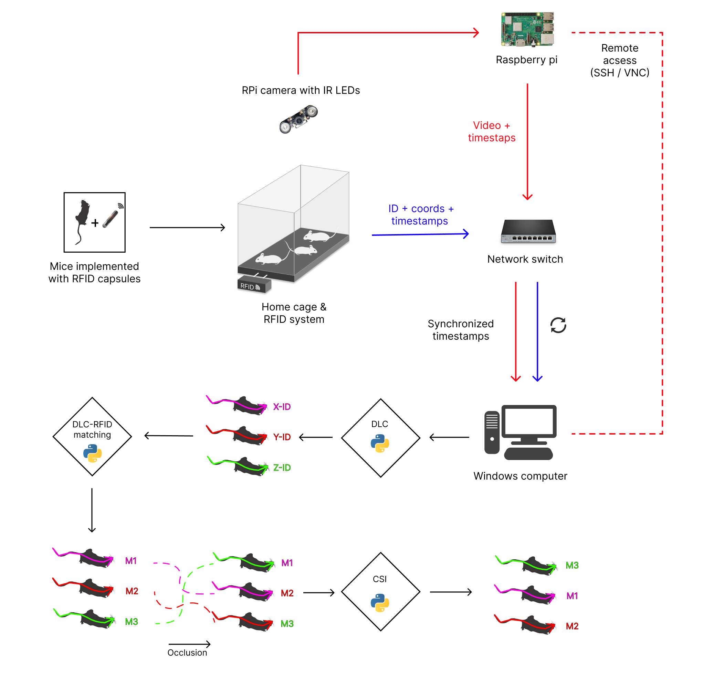
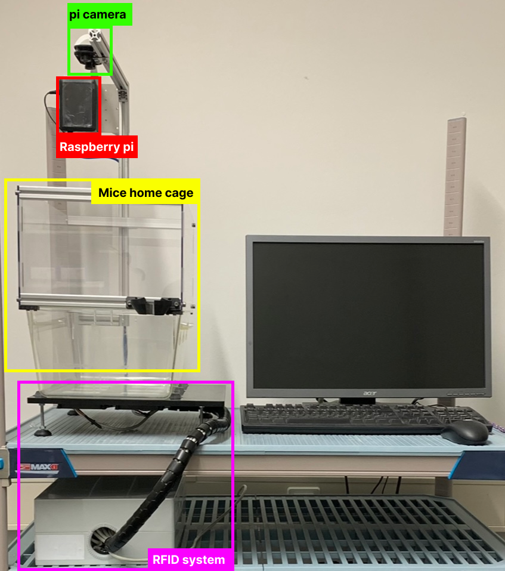
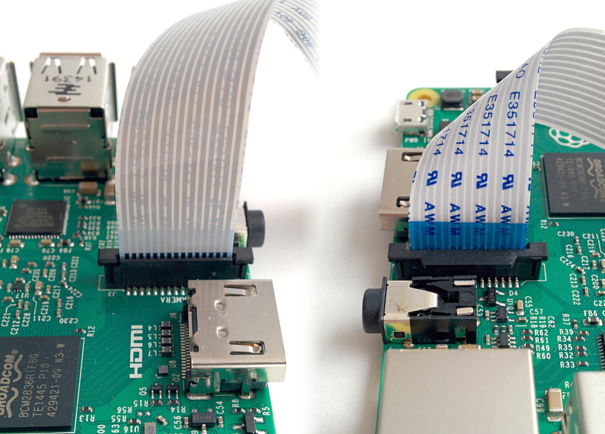
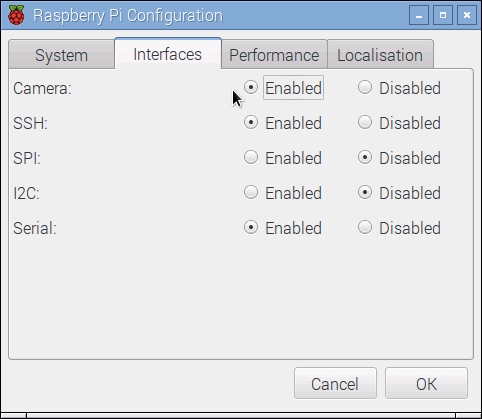
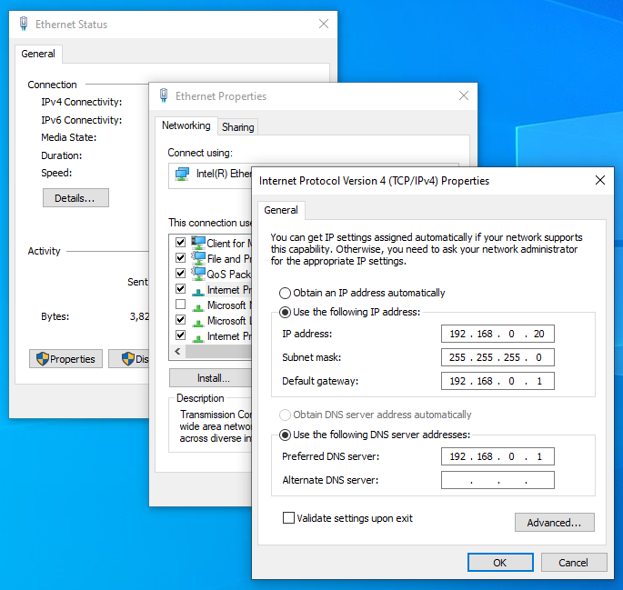

# IN PROGRESS -> CREATING A WIKI

# Table of Contents
[1. Abstract](#abstractintroduction)

# Abstract/Introduction
Locating and tracking moving objects and organisms in spatiotemporal data finds application in a wide variety research [4]. For instance, In the field of neuroscience, social interactions are analysed to provide insights into healthy and pathological cognitive and emotional processes [3]. To realize the location and tracking aspect of such tasks, there exist a variety of methods which can extract and process the necessary information from video data.

This project applies an end-to-end solution based on Deep Neural Networks (DNNs) with the help of DeepLabCut (DLC), a Python framework built on TensorFlow, to investigate its viability in the context of pose estimation and tracking of mice in two experimental setups, which solely rely on raw video data as input.

The experiment uses a single, low-cost camera to record multiple RFID-tagged mice in a cage equipped with RFID sensors. In each recording session, animals are recorded and tracked for about 24 hours, allowing for the capture of a diversity of social interactions and building the basis for social behavior studies. Though not required for tracking, the RFID data can be used to detect potential identity swaps made by the trained DNN as well as match the mice’s RFIDs to their location in video. The final model achieves a test error of 4.9 pixels, which is similar to the labelling variability between humans (5.2 pixels).

# Structure
We are interested in tracking and localizing various body parts and identify multiple identical-looking mice across a broad collection of behaviors. 

In this experiment, we provide a set of scripts that is simple to run, integrating the DeepLabCut toolbox with the RFID technology. The system, implemented in Python, is completely automated. Our scripts are divided into two main stages: Stage I: Pose estimation and multi-animal tracking using DLC, that is used for creating a model for pose estimation and multi-animal tracking, and Stage II: Mouse identification using RFID system. In the first stage, a pose estimation model is created, trained and evaluated. In the second stage, the RFID detections are used to replace DLC dummy IDs with their corresponding RFID tag. Furthermore, we provide a set of scripts for checking and re-matching the mice ID whenever a potential ID swap made by DLC has been detected.

# Experimental setup

Social Interaction: workflow

Setup overview

# 1. Data Acquisition
## 1.1. Video Recording
Video recording is done using the picamera package that provides pure Python interface to the Raspberry Pi camera. If you are using the Rasbian OS then picamera should be already installed. To check, you can start python and try to import picamera:
> python -c "import picamera"

If picamera is not installed, you can simply install it using the apt tool:
> sudo apt-get update
> sudo apt-get install python-picamera python3-picamera

Check [picamera](https://picamera.readthedocs.io/en/release-1.13/install.html) for more information.

### 1.1.2. Getting started
Connect your camera module to the CSI port on your Raspberry Pi; this is the long thin port adjacent to the HDMI socket. Gently lift the collar on top of the CSI port (if it comes off, don’t worry, you can push it back in but try to be more gentle in future!). Slide the ribbon cable of the camera module into the port with the blue side facing the Ethernet port (or where the Ethernet port would be if you’ve got a model A/A+).

Once the cable is seated in the port, press the collar back down to lock the cable in place. If done properly you should be able to easily lift the Pi by the camera’s cable without it falling out. The following illustrations show a well-seated camera cable with the correct orientation:

### 1.1.3. Testing
Now, apply power to your Pi. Once booted, start the Raspberry Pi Configuration utility and enable the camera module:

You will need to reboot after doing this (but this is one-time setup so you won’t need to do it again unless you re-install your operating system or switch SD cards). Once rebooted, start a terminal and try the following command:
> raspistill -o image.jpg

If everything is working correctly, the camera should start, a preview from the camera should appear on the display and, after a 5-second delay it should capture an image (storing it as image.jpg) before shutting down the camera. Proceed to the Basic Recipes.

### 1.1.4. Recording to a network stream
Recording video to a stream is done using a file-like object created from a socket(). We’re sending a continual stream of video frames, so we can simply dump the recording straight to the network socket. Firstly, the server side script which will simply read the video stream and pipe it to a media player for display. 

The PC acts as the server, waiting for a connection from the client (PI). When it accepts a connection, it starts streaming video over it. To enable the commutation between the PC and the PI, the IP address on both sides must be adapted. Follow the instruction to set a static IP address on [Windows](https://support.microsoft.com/en-us/windows/change-tcp-ip-settings-bd0a07af-15f5-cd6a-363f-ca2b6f391ace).

EXAMPLE to set the ip adresses:
On the server side (PC) go to setting > Ethernet > change adapter options > select Ethernet > Properties > select Internet Protocol Version 4 (TCP/IPv4). A window will pop up. Select: Use the following IP addresses: 192.168.10.19 and for the subnet mask: ...
On the PI side set the IP adress to 192.168.10.18
(todo explain this in a better way).

todo: adapt the ip adress on the image.

todo: screenshot the other side on the pi.

The file `server.py` must be run from your PC i.e. on which device the recorded video should be stored. To start listening to the client connection, run:
> python server.py

The file `client.py` must be run on the PI side. It will connect to the network socket and start the recording:
> python client.py

At that moment a new directory with the name of the time of recording session. The folder will contain two files. The video (`date@time.H264`) and the timestamp (`date@time.start_ts.txt`) of the first video frame.
The video file will be used in step `X` to perform the tracking using DLC. The text file will be used to synchronize the video with RFID data to accomplish the ID matching process.
The duration of the recording, the frame rate and resolution can be changed in the `client.py` script.
Default values are set to 24 hours, 25 fps, 1280x720 pixels.

    Note: while the recording session is on, you will probably notice several seconds of latency. This is normal and is because media players buffer several seconds to guard against unreliable network streams. 

[More information](https://picamera.readthedocs.io/en/release-1.13/recipes1.html#recording-to-a-network-stream)

## 1.2. RFID readings
tbc
# Installation
You can clone the scripts of ColonyRack package from GitHub by firing up the shell and typing:

> git clone ..

Alternatively, you can go to the Git repository and download the package manually.

# Help
Arguments in squere brackets are optional [-h] -i  -o  [-w] [-d] [-m] [-p] [-l]

# Examples/demo data

# Usage
The scripts can be run by openning the command prompt (terminal) and excuting the `main.py` file. Type the following to run the scripts with default parameters:
> python3 main.py -i  inputPath -o outputPath

Use the following flags followed with the associated arguments:
> python3 main.py -i  files_directory -o output_directory -w TIME_WINDOW_LENGTH -d minDistDiff_threshold  -m correction_method -p plot_type -l likelihood_threshold

## What you need to get started with the identification and CSI procedures:
- Video(s) containing mice (`mp4` or `H264`).
- A File contains the RFID detection (`CSV`).
- A file containig the starting timestamp of the video (`txt`)

- 
## What you DON’T need to get started:
no specific computer/cameras/videos are required
