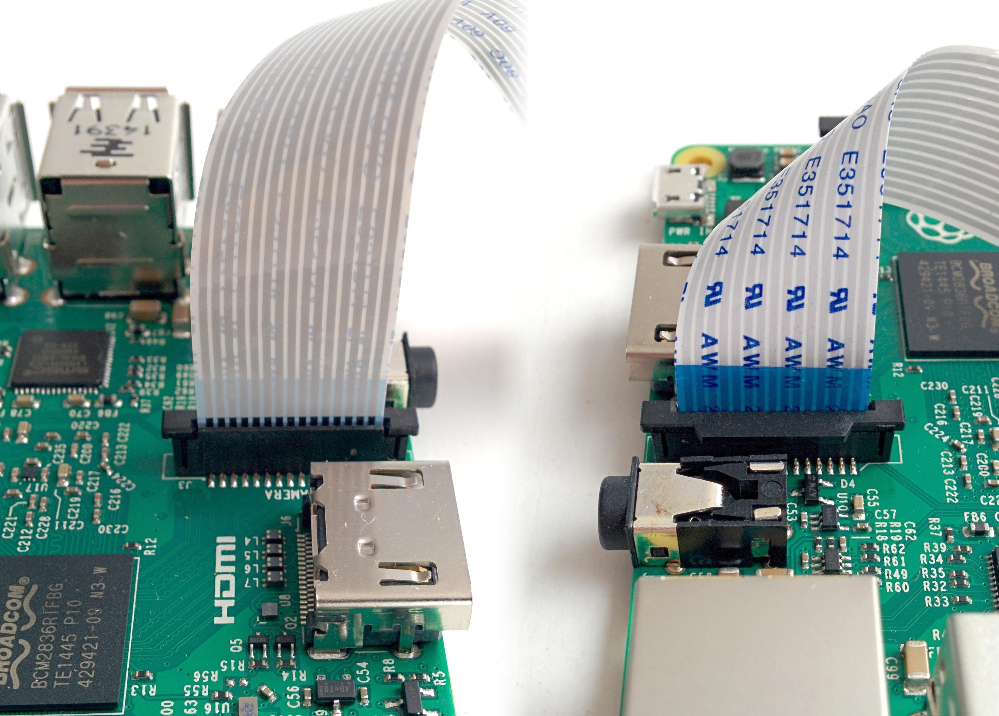

# IN PROGRESS -> CREATING A WIKI

[https://picamera.readthedocs.io/en/release-1.13/install.html](#picamera-installation)
# Table of Contents
[1. Abstract](#abstractintroduction)

<!-- # Data Acquisition
## Video Recording
If the user is want to analyse videos without any interest in distigush between them (no identification) then there is no need for the RFID system. Also there is no need for the RFID system if the animals does not look identical (diiferent coat color) and mice do not need to be microshipped with RFID tags.

If mice need to be identified, then it's required to use the RFID system. Thus, a syncrynisation between the the video and the RFID data is nececarry. The scripts in the directory `video_recording` provides this functionality. The `server.py` file must be run on the server side which is the computer recieving the video (Windows, Unix).  The `client.py` file should be run on the Raspberry pi which is connected to the camera. -->

# Software
The recording is done using the picamera package that provides pure Python interface to the Raspberry Pi camera.
If you are using the Rasbian OS then picamera should be already installed. To check, you can start python and try to import picamera:
> python -c "import picamera"

If picamera is not installed, you can simply install it using the apt tool:
> sudo apt-get update
> sudo apt-get install python-picamera python3-picamera

Check \ref[#picamera-installation] for more information.

# Getting started
Connect your camera module to the CSI port on your Raspberry Pi; this is the long thin port adjacent to the HDMI socket. Gently lift the collar on top of the CSI port (if it comes off, don’t worry, you can push it back in but try to be more gentle in future!). Slide the ribbon cable of the camera module into the port with the blue side facing the Ethernet port (or where the Ethernet port would be if you’ve got a model A/A+).

Once the cable is seated in the port, press the collar back down to lock the cable in place. If done properly you should be able to easily lift the Pi by the camera’s cable without it falling out. The following illustrations show a well-seated camera cable with the correct orientation:

# 2.2. Testing
Now, apply power to your Pi. Once booted, start the Raspberry Pi Configuration utility and enable the camera module:

You will need to reboot after doing this (but this is one-time setup so you won’t need to do it again unless you re-install your operating system or switch SD cards). Once rebooted, start a terminal and try the following command:

> raspistill -o image.jpg

If everything is working correctly, the camera should start, a preview from the camera should appear on the display and, after a 5 second delay it should capture an image (storing it as image.jpg) before shutting down the camera. Proceed to the Basic Recipes.

# 3.13. Recording to a network stream
This is similar to Recording video to a stream but instead of an in-memory stream like BytesIO, we will use a file-like object created from a socket(). Unlike the example in Capturing to a network stream we don’t need to complicate our network protocol by writing things like the length of images. This time we’re sending a continual stream of video frames (which necessarily incorporates such information, albeit in a much more efficient form), so we can simply dump the recording straight to the network socket.

Firstly, the server side script which will simply read the video stream and pipe it to a media player for display:

> code

You will probably notice several seconds of latency with this setup. This is normal and is because media players buffer several seconds to guard against unreliable network streams. 

Now for the client side script which simply starts a recording over a file-like object created from the network socket:

> code

However, this recipe does serve as a starting point for video streaming applications. It’s also possible to reverse the direction of this recipe relatively easily. In this scenario, the Pi acts as the server, waiting for a connection from the client. When it accepts a connection, it starts streaming video over it for 60 seconds. 

More information [https://picamera.readthedocs.io/en/release-1.13/recipes1.html#recording-to-a-network-stream]

<!-- # Installation
You can clone the scripts of ColonyRack package from GitHub by firing up the shell and typing:

> git clone ..

Alternatively, you can go to the Git repository and download the package manually.

# Help
Arguments in squere brackets are optional [-h] -i  -o  [-w] [-d] [-m] [-p] [-l]

# Examples/demo data

# Usage
The scripts can be run by openning the command prompt (terminal) and excuting the `main.py` file. Type the following to run the scripts with default parameters:
> python3 main.py -i  inputPath -o outputPath

Use the following flags followed with the associated arguments:
> python3 main.py -i  files_directory -o output_directory -w TIME_WINDOW_LENGTH -d minDistDiff_threshold  -m correction_method -p plot_type -l likelihood_threshold

## What you need to get started with the identification and CSI procedures:
- Video(s) containing mice (`mp4` or `H264`).
- A File contains the RFID detection (`CSV`).
- A file containig the starting timestamp of the video (`txt`)

- 
## What you DON’T need to get started:
no specific computer/cameras/videos are required -->
